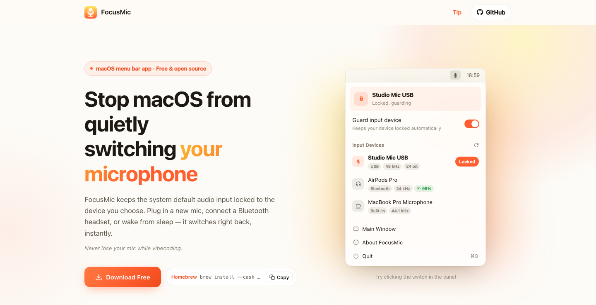

# FocusMic

[简体中文](README.zh-CN.md) | [Website](https://focusmic.yayalu.top/) | [Releases](https://github.com/lageev/FocusMic/releases/latest)

Lock your macOS input microphone from the menu bar.

FocusMic is a small open-source macOS utility that keeps the system default audio input on the microphone you choose. If macOS, a Bluetooth headset, a USB interface, or another app changes the default input, FocusMic can switch it back automatically.



## Install

Download the latest build from [GitHub Releases](https://github.com/lageev/FocusMic/releases/latest), or install with Homebrew:

```sh
brew install --cask lageev/tap/focusmic
```

Runtime requirement: macOS 15.0 or later.

## Use

1. Open FocusMic.
2. Click the menu bar icon.
3. Choose the input device you want to keep.
4. Turn on **Guard input device**.

When the chosen device is online, FocusMic keeps it as the system default input. If the device disconnects, FocusMic waits and restores it when it comes back.

## Features

- Menu bar device picker and guard switch.
- Automatic restore when the default input changes.
- Optional input volume lock for the selected device.
- Optional live input level meter, calculated locally.
- Device details: transport type, sample rate, bit depth, channels, volume, and in-use state.
- Hot-plug support for USB, Bluetooth, built-in, and other Core Audio input devices.
- Recent activity log.
- Launch at login.
- Direct-download updates via Sparkle. App Store builds are updated by the App Store.

## Privacy

FocusMic runs locally on your Mac.

- It does not record, upload, or analyze audio.
- The level meter only reads local loudness in real time and stores nothing.
- There is no account, analytics, ads, tracking, or crash reporting.
- GitHub/Homebrew builds only use the network for Sparkle update checks.
- Preferences are stored locally in `UserDefaults`.

Read the full [Privacy Policy](https://focusmic.yayalu.top/privacy).

## Develop

Requirements:

- macOS 15.0 or later
- Xcode 16 or later with the macOS 15 SDK

Run from source:

1. Clone this repository.
2. Open `FocusMic.xcodeproj` in Xcode.
3. Select the `FocusMic` scheme.
4. Run from Xcode.

Main technologies: SwiftUI, Core Audio, Observation, ServiceManagement, and Sparkle.

## Project Structure

```text
.
├── FocusMic.xcodeproj/     # Xcode project
├── FocusMic/
│   ├── App/                # App entry, lifecycle, updater, brand links
│   ├── Audio/              # Core Audio device model and guard logic
│   ├── Settings/           # Preferences and launch-at-login support
│   ├── UI/                 # SwiftUI menu bar, main window, rows, logs
│   ├── Assets.xcassets/    # App icons and colors
│   └── IconSources/        # Source icon assets
├── docs/assets/            # README images
├── SupportFiles/           # Info.plist and entitlements
├── landing/                # Website, legal pages, appcast
├── README.md
└── README.zh-CN.md
```

## Links

- [Website](https://focusmic.yayalu.top/)
- [Terms](https://focusmic.yayalu.top/terms)
- [Privacy](https://focusmic.yayalu.top/privacy)
- [Issues](https://github.com/lageev/FocusMic/issues)

## License

MIT
